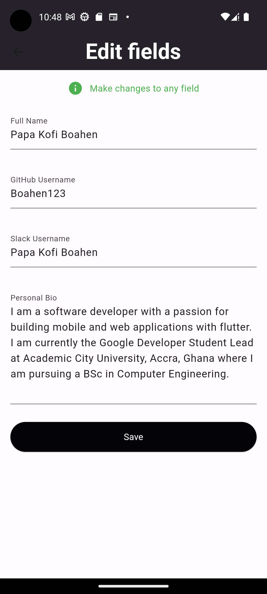

# Papa Kofi's CV Application

Access my GitHub Profile, Slack Username and other credentials similar to my curriculum vitae.

## Overview

This app displays information about Papa Kofi. It also provides a functionality to edit the information fields.  

# Screenshot

 
  
 <b>Home Screen</b> 
   
  
  

  
 <b>Edit Screen</b>

# Setup Instructions

- Ensure you have **flutter SDK** installed. Check the official documentation for [system requirements](https://docs.flutter.dev/get-started/install/windows#:~:text=System%20requirements,-To%20install%20and&text=Operating%20Systems%3A%20Windows%2010%20or,being%20available%20in%20your%20environment.&text=Git%20for%20Windows%202.x,the%20Windows%20Command%20Prompt%20option.)
- Clone this repository to your local workstation
- Run <code> flutter pub get </code>f
- Issue flutter run in your terminal, making sure to start an android emulator or by connecting to a physical android device.

# Implementing core functionality

[GetX](https://pub.dev/packages/get) is a popular open-source state management and navigation framework for Flutter. GetX provides a set of tools and libraries that help developers manage the state of their Flutter applications and navigate between different screens or pages.

### GetX used to provide state management

GetX is used to store the information or data as states that can be modified. Upon modification, only the widget with the modified data rebuilds to update the UI saving some RAM.

### GetX used to provide navigation

With GetX, navigation is seamlessly without the need to access the context object.

### GetX used to open Snackbar

Upon successfully editing the fields, a SnackBar offers a user-friendly feedback to the user.

 

[online documentation - flutter.dev](https://docs.flutter.dev/)
